<!--
> _The following template provides the headings for your Design
> Documentation.  As you edit each section make sure you remove these
> commentary 'blockquotes'; the lines that start with a > character
> and appear in the generated PDF in italics._
-->

# Team Information

-   Team name: Team 7g
-   Team members
    -   Daniel Chapin
    -   Adrian Deslongchamps
    -   Sebastian LaVine
    -   Srikar Sundaram
    -   Serene Wood

# Executive Summary

Our project is the creation of a fully-implemented estore to sell homemade, customizable wood carvings to the customer, and provide an advanced control-panel for the owner to manage their stock.

## Purpose

This site operates as an estore to sell wood carving products to online customers. The goal of our site is to provide an accessible shop page for customers to make purchases and owner(s) to view and edit their shop.

## Glossary and Acronyms

| Term       | Definition                                                 |
| ---------- | ---------------------------------------------------------- |
| SPA        | Single Page                                                |
| API        | Application Programming Interface                          |
| DAO        | Data Access Object                                         |
| JSON       | JavaScript Object Notation                                 |
| REST       | Representational state transfer                            |
| MVP        | Minimum Viable Product                                     |
| Item       | An object representing part of a Product's customization   |
| Product    | A customized object composed of a Carving, Wood, and Base  |
| CartEntry  | An object dictating a product and that product's quantity  |
| Purchase   | Object with CartEntry, and the status history              |
| Status     | Object with the status and time of an update               |
| StatusEnum | Enumerate values from Delivered, Delayed, Shipped, Ordered |

# Requirements

This section describes the features of the application.

## Definition of MVP

Our site requires these main features to function on an acceptable level:

-   Items options stored in inventory.
-   A way for Customers to view and select from available items.
-   User-specific shopping carts to store and display selected Products as CartEntrys.
-   Login/Logout features for customers and admin(s) that grant shopping cart and item-management access respectively.
-   A control panel for the owner to manage items and view purchase history.
-   A navigable, user-friendly website that includes all of the above.

## MVP Features

The main Epics required to complete the website include the following:

-   Epic: Create Angular UI
-   Epic: Authentication
-   Epic: Products Design
-   Epic: Modify Inventory
-   Epic: Shopping Cart
-   Epic: View and Purchase Products
-   Epic: Sales Analytics - 10% feature

<!-- 1 epic not included for this design doc -->

## Roadmap of Enhancements

For the owner, there will be convenient accessibility to site analytics through a sales dashboard and customization access through the item management system.

In implementing these enhancements, priority will be placed on implementing customer-focused enhancements, including customization, usability, and the flow of the website. We will then focus on enhancing the owner's experience by implementing inventory customization access and sales analytics.

# Application Domain

The site operates through the UI-implemented browser site, for use by both customers and the owner(s). The application's domain exists as a retail-business website.


The major entities of our domain model are as follows: Store Owner, EStore, Inventory, Carving, Base, Wood, Buyer, Shopping Cart, Checkout, Purchase History, and Sales Dashboard.

The Store Owner is the owner of the small business that sells wood carvings. They are also the admin of the EStore, which means they are able to add to, remove from, and otherwise modify the Inventory. The Inventory holds all of the products that have been added (and not removed) by the Store Owner.

The product that the small business is selling is a Carving. A Carving has three customizable properties: Carving, Base, and Material. The carving specifies what animal carving is being purchased. The Base specifies the shape of the base that a Carving is done on -- such as a circle or square. And the Wood specifies the type of wood that the Carving is made of -- such as oak or spruce.

We mentioned earlier that the Store Owner can add to, remove from, and modify the Inventory. What this means specifically is that the Store Owner can add/remove/modify Carvings, add/remove/modify Bases, and add/remove/modify Woods. For example, the Store Owner could add a Lizard Carving, delete a Triangle Base, and modify the price of Oak Wood.

When a Buyer makes an account, a username, password, and Shopping Cart are associated with that account. The Buyer is able to add Carvings to their Shopping Cart -- when they do so, it is required that they specify what Base and Material they want their Carving to be on and be made of, respectively. (It is important to note that a Buyer cannot add a Base or Material on its own to the Shopping Cart -- Base and Material are properties of the Carving. Furthermore, a Carving must have a Base and Material in order to be added to the Shopping Cart).

From the Shopping Cart, the Buyer is able to proceed to Checkout in order to purchase the Carvings in their cart. The Buyer's geolocation data is taken (with their permission, of course) in order to calculate the shipping cost, and from there the total cost of all the Carvings in the Buyer's Shopping Cart plus shipping. Once the Buyer has proceeded through Checkout, their Shopping Cart is emptied, and the information about the Carvings they purchased is sent to the Purchase History.

The Purchase History contains information about every single Carving (and its associated Base and Wood) that has ever been purchased in the E-Store. The Store Owner is the only one who has access to the Purchase History. Here the Store Owner is able to change the status of a Carving and filter through the most recently purchased Carvings by status, with these statuses being Ordered, Shipped, Delayed, and Delivered.

The Sales Dashboard is our 10% additional feature. Only the Store Owner can view the Sales Dashboard, which tracks and displays the sales of all Carvings, Bases, and Woods over time, as well as the total profit from those sales. This information is displayed on a quarterly basis for each year. The data that has been accumulated in the Purchase History provides the information for the Sales Dashboard.

# Architecture and Design

This section describes the application architecture.

## Summary

The following Tiers/Layers model shows a high-level view of the webapp's architecture.


The e-store web application, is built using the Model–View–ViewModel (MVVM) architecture pattern.

The Model stores the application data objects including any functionality to provide persistance.

The View is the client-side SPA built with Angular utilizing HTML, CSS and TypeScript. The ViewModel provides RESTful APIs to the client (View) as well as any logic required to manipulate the data objects from the Model.

Both the ViewModel and Model are built using Java and Spring Framework. Details of the components within these tiers are supplied below.

## Overview of User Interface

This section describes the web interface flow; this is how the user views and interacts with the e-store application.

The homepage offers a site display page with graphics that reflect the company site; on all major navigation sites, a navigation bar along the top will allow users to navigate to the Home, Shop, Search, login/out, and Shopping Cart page; each of the named pages also have the navigation bar for ease of access between parts of the website. Every instance of a listed carving also contains a link to that specifc carving's site.

For owners, additional navigation features are shown when logged in, including a Manage-Items page to modify the inventory of the website; these admin-only tabs are not visible or accessable when not logged in as an admin account.

## View Tier

<!-- _Provide a summary of the View Tier UI of your architecture.
> Describe the types of components in the tier and describe their
> responsibilities.  This should be a narrative description, i.e. it has
> a flow or "story line" that the reader can follow._

> _You must also provide sequence diagrams as is relevant to a particular aspects
> of the design that you are describing.  For example, in e-store you might create a
> sequence diagram of a customer searching for an item and adding to their cart.
> Be sure to include an relevant HTTP reuqests from the client-side to the server-side
> to help illustrate the end-to-end flow._-->

<!---
- [x] Summary of the view tier (# Overview of User Interface)
- [x] HTTP Requests
- [x] Sequence diagrams
- [x] components story line
- [x] Searching sequence diagram
-->

| Name                 | Function                                                            |
| :------------------- | :------------------------------------------------------------------ |
| `add-item`           | Controls a form dialog with item to add                             |
| `admin-manage-items` | Contains the list of products. Parent of add item & update item.    |
| `analytics`          | Tracks sales of all items over time                                 |
| `manage-purchases`   | Admin can filter through and/or fulfill recent purchases            |
| `update-items`       | Controls a form dialog with item to update                          |
| `checkout`           | Allows buyer to purchase the carvings in their shopping cart        |
| `app`                | Main Homepage which contains: navbar, products page.                |
| `dashboard`          | A mission statement and about us page.                              |
| `item-search`        | Provides a space to search for products by name.                    |
| `items`              | Used to show products on home and shop page.                        |
| `login`              | Provides a login and signup page.                                   |
| `product-detail`     | Maps to `/product:id` send to by home page for adding to cart.      |
| `shopping-cart`      | Shopping cart made available to a user to edit their shopping cart. |

Table: List of Angular Components

### Components: Narrative

The user visits the website to and is greeted with a banner and a navigation bar, 
this is handled by the `app` component. There is a `item-search` component which shows 
a search bar.  Below it, the user sees a subset of items which are displayed, random 
on each visit, which is controlled by `items` component. And finally for a footer, 
handled by `dashboard` component, is a mission statement and about us.

#### Customer

The customer then clicks on products from the navigation bar. The customer is shown a 
list of items, displayed in panels of cards managed by `Items` component. 
The customer clicks on one specific product, and is navigated to a page handled by
`product-detail`, which has an image and a form of the product.

Once the customer lands on the page, they see they need to login to add it to cart.
The customer clicks on login, and is taken to page from `login` component. The customer
there can enter sign up or login. In either case, they are now back on the home page.
But now in the navigation bar they have a shopping cart button.

The customer navigated back to the product page, and adds something to cart. 
The customer click on shopping cart and goes to page from the `shopping-cart` component. 
The customer can, if all quantities are valid, move forward to the checkout page
handled by the `checkout` component, and the customer's journey ends.


#### Admin

The admin starts off with the homepage like a normal user. Once the admin navigates
to the login page, if they are an admin as authorized by the model, they can 
see manage items, manage purchases, and the analytics button. 

The `admin-manage-items` component handles the manage items's page, here the admin is 
able to see all items and delete, edit or add an item. If the admin chooses 
to add a carving, a modal which is handled by `add-items`, the admin must enter
name, quantity, price. Once the admin submits, they are back to the manage items
page with the new item. 

If the admin edits an item, they get a modal handled by `update-items`,
the admin can enter quantity or price. Once the admin submits, they are back to the 
manage items page with updated item.

Admin navigates to manage purchases, handled by `manage-purchases`, they 
see a list of products which are purchased, the admin can filter them by the 
current status of the purchase and its details. Admin then navigates to the
analytics page controlled by `analytics` component; here the admin can see 
amount of revenue from sales quarter-over-quarter. The admin's journey ends here.


### REST API Endpoints

| Name            | Request | URI                     | Input                                   | Output      |
| :-------------- | :------ | :---------------------- | :-------------------------------------- | ----------- |
| getItem         | GET     | `inventory/{id}`        | Path: ID                                | Item        |
| searchItems     | GET     | `inventory/`            | Param: Search Term                      | Item[]      |
| getItems        | GET     | `inventory`             | None                                    | Item[]      |
| getProduct      | GET     | `inventory/product/`    | Request Param: carving ID               | Product     |
| createItem      | POST    | `inventory/item`        | Body: Item                              | Item        |
| updateItem      | PUT     | `inventory`             | Body: Item                              | Item        |
| deleteItem      | DELETE  | `inventory/item/{id}`   | Path: ID                                | Item        |
| getUserCart     | GET     | `cart`                  | Param: username                         | CartEntry[] |
| deleteUserCart  | DELETE  | `cart/user`             | Param: username                         | Boolean     |
| deleteCartEntry | DELETE  | `cart/entry`            | Param: username and Param: id           | CartEntry   |
| updateCartEntry | PUT     | `cart/entry`            | Param: username and Body: CartEntry     | CartEntry   |
| createCartEntry | POST    | `cart`                  | Param: username and Body: CartEntry     | CartEntry   |
| createUser      | POST    | `/auth/signup`          | Body: User                              | User        |
| login           | POST    | `/auth/login`           | Body: User                              | User        |
| logout          | POST    | `/auth/logout`          | Body: User                              | Void        |
| getUser         | POST    | `/auth/get`             | Body: User                              | User        |
| isAdmin         | POST    | `/auth/isadmin`         | Body: User                              | Boolean     |
| addPurchase     | POST    | `purchase/add`          | Body: CartEntry, Request Param username | Purchase    |
| updateStatus    | PUT     | `purchase/updateStatus` | Body: purchase                          | Purchase    |
| getPurchases    | GET     | `purchase/getPurchases` | Param: status                           | Purchase[]  |
| deletePurchase  | DELETE  | `purchase/delete/{id}`  | Path: Variable id                       | Void        |

Table: HTTP Requests

### Search: Sequence Diagram

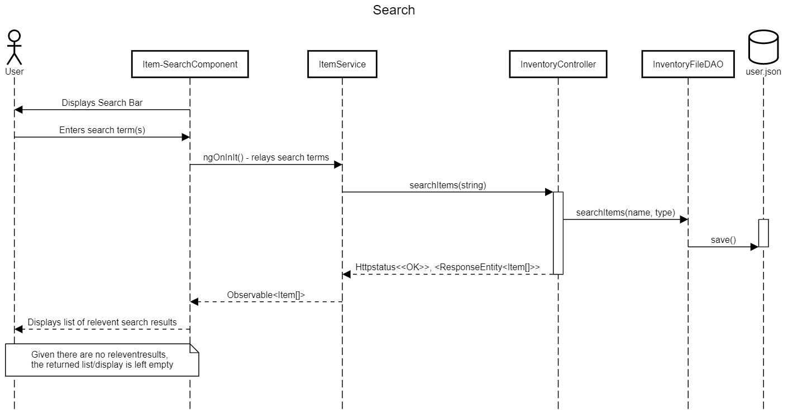

### Add To Cart: Sequence Diagram


### Checkout: Sequence Diagram


The checkout process begins after the user clicks the "Proceed to Checkout"
button on the Shopping Cart page. Shipping information is then requested from
the user on the frontend, and all that information is passed through the
ItemService to the PurchaseHistoryController on the backend. The
PurchaseHistoryDAO writes to disk the info of the purchase, and also makes
calls to the cartFileDAO to empty the user's shopping cart, and the
InventoryFileDAO to update the inventory count of the items in stock. An
HTTPStatus will be passed representing the result of the backend operation, and
the user display will be updated to reflect this. If all is well, the screen is
cleared; if there is a problem an alert is shown to the user to fix it.

### Add Item (Admin): Sequence Diagram

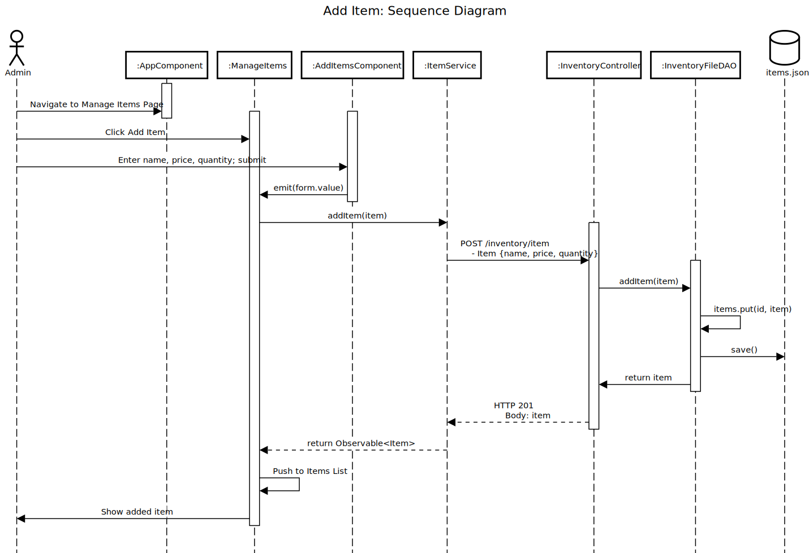

### Update Item (Admin): Sequence Diagram


### Login: Sequence Diagram

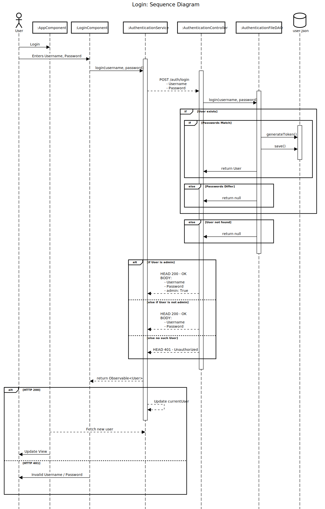{ height=8.5in }

### Delete Item (Admin)

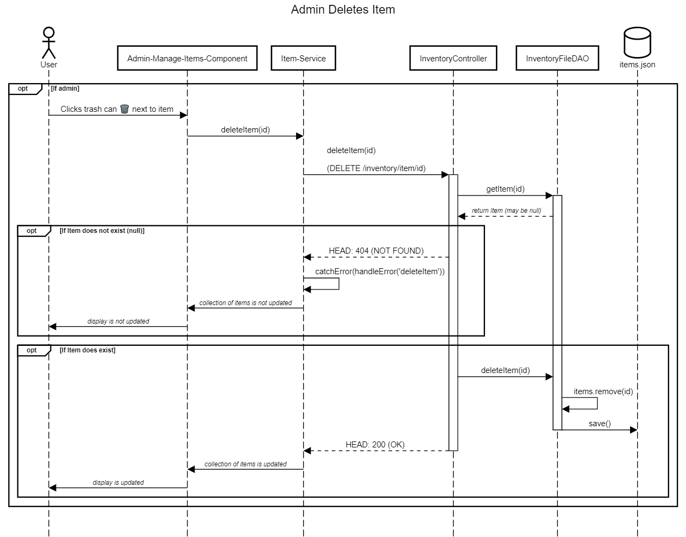
If the user is logged in as the admin, they are able to view a list of the existing items in the system via the Angular Admin-Manage-Items-Component and click on the trash can icon next to one of them in order to begin the process of deletion. Admin-Manage-Items-Component calls on Item.service which in turn sends an HTTP request to the InventoryController which calls on the InventoryFileDAO to return the ID of the item that the admin is trying to delete. (This is an example of movement from View to ModelView to Model.) If the item that the admin is trying to delete doesn't exist (this should never happen but just in case there is error checking for this), a 404 is returned by the InventoryController and the error is handled by Item.service and the Angular display is not updated. If the item that the admin is trying to delete does exist (this should always happen), then InventoryController will finally call on InventoryFileDAO to actually delete the item from items.json and save() the changes. An HTTP 200 is returned and the Angular display is updated to reflect that the item has been deleted. 


## ViewModel Tier

The view model tier contains all interaction between the front-end and the back-end of the website and handles relevant HTTP requests and errors.
View-model control is delegated to the items.service and authentication.service, which each handle data requests to/from the front end. Items.service holds responsibility over manipulation requests for the site inventory (Items/Products/CartEntrys/Purchases), while authentication.service handles login/out requests and prevents unauthorized access.

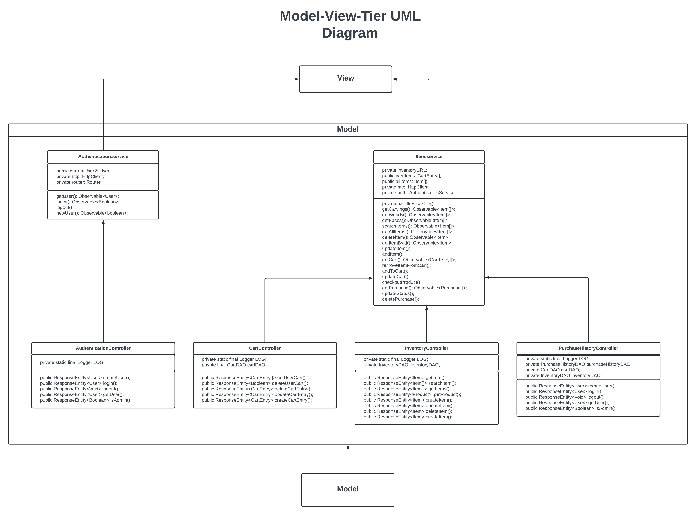

### ViewModel: Class Diagram


The REST specifications are discussed in the table above.

## Model Tier

The Model tier contans the logic and manipulation of all data; specifically
handling the changes made to Users, Items, Products, Purchases, and CartEntry objects.
Each part of our model has a respective Controller and Persistence file - except
Product, which acts as an accumulation of three items and is used in the creation
of CartEntry.

### Model: Persistence


The four interfaces implementations correspond to one file JSON managed.

For all of these implementations, the file is fetched once at the instantiation
of the class and only written if an operation requires it. In Spring, all
components are singletons, so this happens only once.

#### Authentication

The file which `AuthenticationFileDAO` writes to is `users.json`.

Minimally, it must provide for sign-up, login, logout and getDetails. All of
these, if any, take a User. User may contain null fields. For example, in
`getDetails`, minimally, the user's token must be defined.

Login returns the User entity iff user's username and password matches.
Otherwise, null.

For signing up, the user's username is unique which is enforced by returning
null on breach of this contract.

Logout simply deletes the user's token. If the user does not exist, it does
not do anything. An error for this is unnecessary.

To check of a user's information, the token must be defined in the User entity
and if it exists, it will fetch the information of the user associated with
that token.

#### Inventory

The file which `InventoryFileDAO` writes to is `items.json`.

`getItem` fetches an item by the id.

`CreateItem` returns the Item entity with a new, unique id if all fields
are properly filled.

For updating an item, an item is replaced by the `id` of the item passed in.
Delete quantity removes that item from disk. decreaseQuantity can take an
integer of item ids and decrease their quantities.

Same products and can purchase look up the latest available item and compare
if the cartEntry passed in contains the same product's price and quantity and
the quantity is greater than 0.

This is needed because for example: A user adds an item to their cart which
has a quantity of 5, it is checked out by someone else. The item needs to
compared to the latest information of that item and the number 5 in quantity
is out of date.

#### Cart

The file which `CartFileDAO` writes to is `carts.json`.

This persistance class handles all processing required for managing a user's
cart prior checkout.

In all cases, a username is required. `DeleteCartEntry` deletes an `CartEntry`
with an id and a username. Updating it simply replaces the passed in
`cartEntry`'s identified by its id. `CreateCartEntry` creates a new entry
to the user's cart, assigning it a new id.

#### Purchase History

The file which `PurchaseHistoryFileDAO` writes to is `purchases.json`.

This file controls all operations post-checkout.

`getPurchases` may be supplied a statusEnum to find all purchases at for example
the `Ordered` level. If not supplied, will find all purchase.

Add Purchase will add a purchase to a user's cart. `DeletePurchase` indicates
the order has been fulfilled and can be deleted from the database. `updatePurchase`
will only replace the updated status, since all other fields are not mutable.

### Model: Entities


Considering this diagrams in the order of specifics to generals:

#### Item

An item is of type `Carving`, `Base`, or `Wood`. Its name, quantity and price
correspond to the said properties as set by the admin. An `id` is generated when created.
These are not singletons because if a user purchases when the price is $5,
it should remain at that price even if the price is changed in the future.

#### Product

Every product contains a `Carving`, `Base`, or `Wood`. Its price is the sum of
the price of the items.

#### CartEntry

CartEntry represents an item in a user's cart. It contains an `id`, `quantity`
and `product`. Quantity signifies the fact that a user will not have two cart
entries who have the same product. There is a one-to-one correspondence between
a product and the (CartEntry, User).

#### UserCart

UserCart contains all cartEntries in a user's cart and user's username.

#### StatusEnum

An enum defined in Status. Contains a limited set of values where a `Purchase` may be

-   `Ordered`
-   `Shipped`
-   `Delayed`
-   `Delivered`

#### Status

A Status is particular instance of a status update. It contains a statusEnum
and `Instant`, which part of the java standard library and records time & date.

#### Purchase

When a user checks out an entry, it is removed from the user's cart and added
as a `Purchase`. Its status begins with `Ordered` and is added to the history
of statuses. Every time the admin updates its status, the old status is added
to the list of history statuses and the current one updated.

#### User

A user has an a token, username, and a password. The user's token is not exposed
to any class which may hold its reference. Each token is associated with an current
login session.

This has two benefits:

1. User can invalidate their session by logging out, or otherwise delete their token.
2. Over an insecure connection, HTTP request body can be read and if it contains the password is not safe.

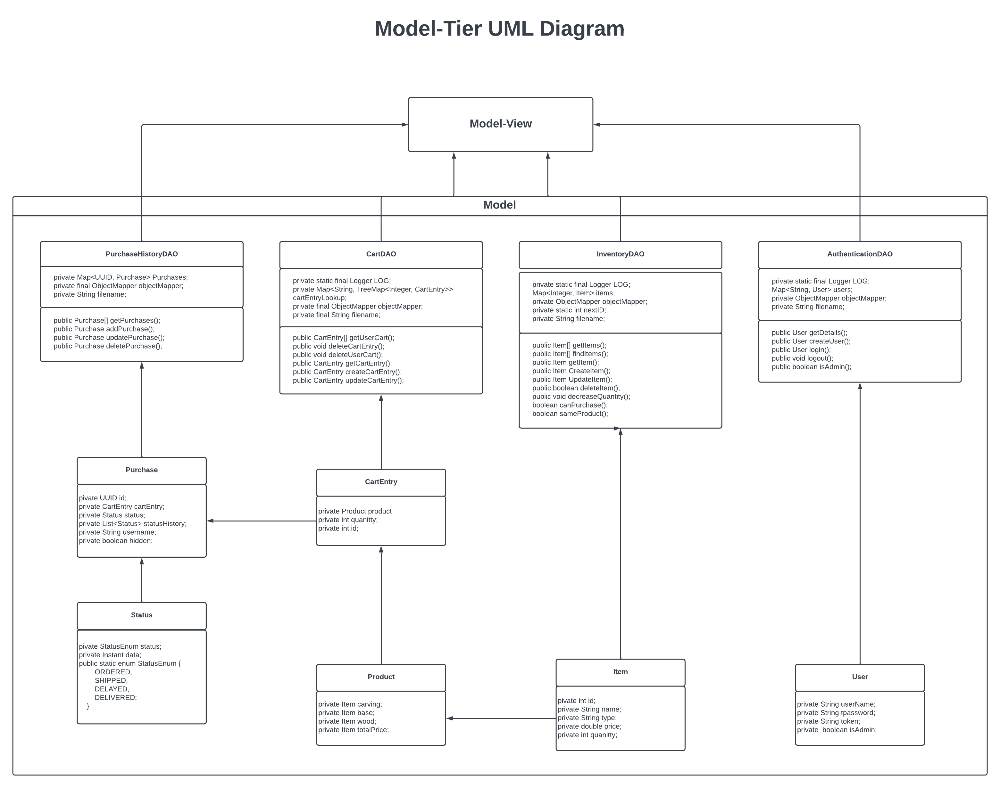

## Static Code Analysis/Design Improvements

<!-- > _Discuss design improvements that you would make if the project were
> to continue. These improvement should be based on your direct
> analysis of where there are problems in the code base which could be
> addressed with design changes, and describe those suggested design
> improvements._

> _With the results from the Static Code Analysis exercise,
> discuss the resulting issues/metrics measurements along with your analysis
> and recommendations for further improvements. Where relevant, include
> screenshots from the tool and/or corresponding source code that was flagged._ -->

We utilize sonarqube to study our code, both for the API side and the frontend.
Although sonarqube can analyze code coverage they will be discussed in the testing section.

Running sonarqube on projects will display the following dashboard.

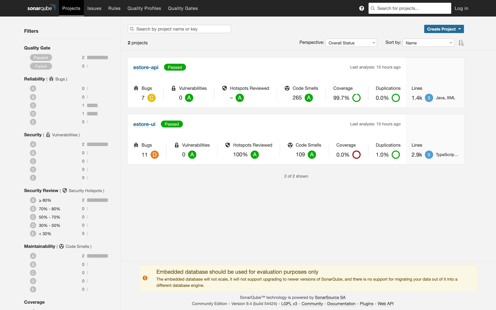

Sonarqube highlights the following concerns code using which might have a
security impact. Three of them revolve around the fact that randomizing products
which appear on the homepage are randomized using `Math.random`, which is not
cryptographically secure, and another one is involved with using geolocation.

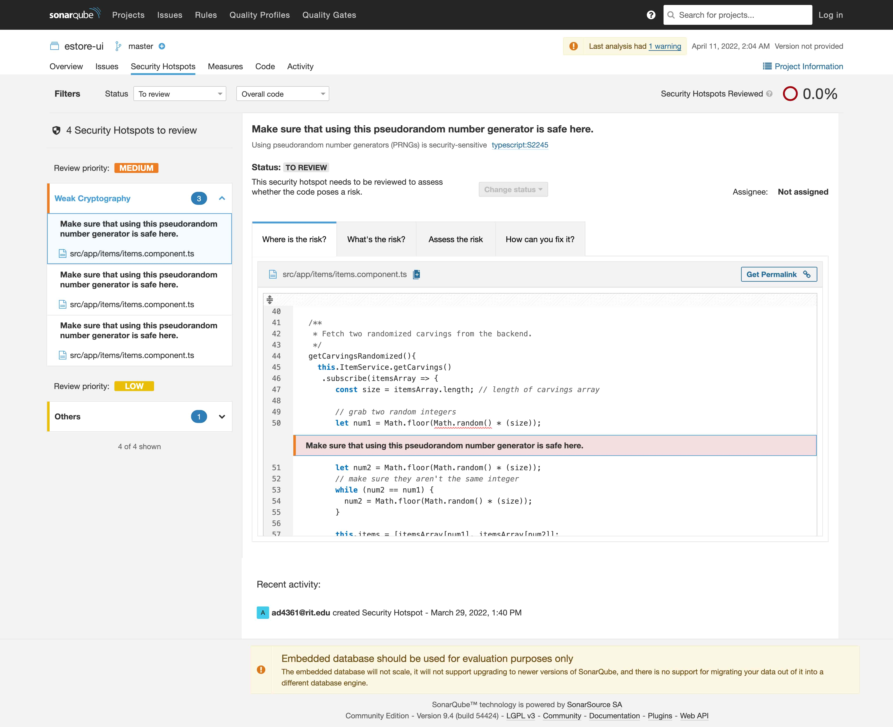

We consider the issue of non-cryptographically secure numbers trivial in this
context, and geolocation is required to provide a shipping estimate, although
other less intrusive options can be considered.

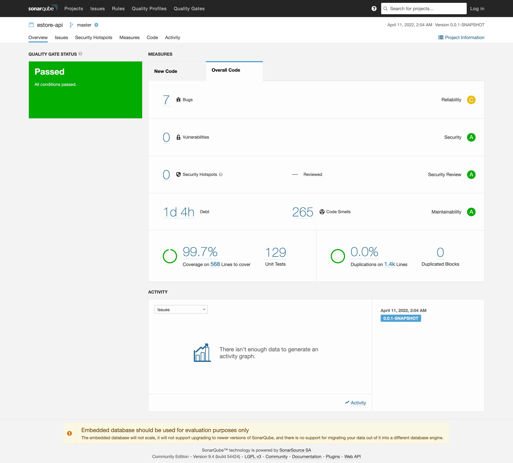

![Bugs][(./documentation/sonarqube/bugs.png)

The equals method should have a hashcode and should we continue we would add it. 
However, we do not use it directly or in a data structure which requires it. It 
is certainly not a breaking problem. 

We should do a type check here which is high priority. We have not encountered this bug
directly because it has not come up yet in regular use. 


### Design: Information Expert

#### Application

The `canPurchase` is provided by the implementors of Inventory data access
objects. Inventory is directly responsible keeping track of available inventory
and it provides the functionality of checking if items in a user's cart.

```java
public boolean canPurchase(CartEntry entry) {
    int quantity = entry.getQuantity();
    if (this.items.get(entry.getProduct().getBase().getId()).getQuantity() < quantity ||
            this.items.get(entry.getProduct().getWood().getId()).getQuantity() < quantity ||
            this.items.get(entry.getProduct().getCarving().getId()).getQuantity() < quantity) {
        return false;
    }

    return true;
}
```

#### Improvements

There is a violation of the law of demeter, and a more simple way should be
considered to get all components of product directly from the product's instance
or some other way which does not expose intermediate objects.

### Design: Dependency inversion/injection

#### Application

The principle states that high level modules should only high level
implementation and use them as an interface rather than interacting with the
low level thing directly.

In our case, this comes in where the HTTP request is resolved into saving to
file. The view just sends a request to the controller.

```java
@PostMapping("/product")
public ResponseEntity<Product> createProduct(@RequestBody Product product) {
    LOG.info("POST /inventory/product " + product);
    try {
        Product newProduct = inventoryDAO.createProduct(product);
        if (newProduct == null) {
            return new ResponseEntity<>(HttpStatus.CONFLICT);
        }
        return new ResponseEntity<>(newProduct, HttpStatus.CREATED);
    } catch (IOException e) {
        LOG.log(Level.SEVERE, e.getLocalizedMessage());
        return new ResponseEntity<>(HttpStatus.INTERNAL_SERVER_ERROR);
    }
}
```

Observe, it does not interact with the file system. This makes is simpler,
if in the future, this were to instead be connected with a different database.

Because the interface is provided as:

```java
/**
    * Creates and saves a {@linkplain Product product}
    *
    * @param product {@linkplain Product product} object to be created and saved
    * <br>
    * The id of the product object is ignored and a new uniqe id is assigned
    *
    * @return new {@link Product product} if successful, false otherwise
    *
    * @throws IOException if an issue with underlying storage
    */
Product createProduct(Product product) throws IOException;
```

And the implementation is not defined, which means it can be anything:
file I/O, SQL, noSQL. It is more extensible.

#### Improvements

Currently, this principle is broken when someone needs to find a product's
name in its entirety. The find method (see below) does not allow looking for
text in its entirety. This is a problem because looping over the resulting array
from the find method is interacting at a level lower than needed.

### Design: Law of Demeter

#### Application

The law of Demeter restricts access to internal data and only provides
information to the specific thing asked for. In our case, this is well explained
by the finding of products. The controller simply searches for them from:

```java
@GetMapping("/")
public ResponseEntity<Product[]> searchProducts(@RequestParam String name) {
    try {
        LOG.info("GET /inventory/" + name);
        return new ResponseEntity<>(inventoryDAO.findProducts(name), HttpStatus.OK);
    }
    catch(IOException e){
        LOG.log(Level.SEVERE, e.getLocalizedMessage());
        return new ResponseEntity<>(HttpStatus.INTERNAL_SERVER_ERROR);
    }
}
```

And the implementation is:

```java
private Product[] getProductsArray(String containsText) {
    // if containsText == null, no filter
    ArrayList<Product> productArrayList = new ArrayList<>();

    for (Product product : products.values()) {
        if (containsText == null || product.getName().contains(containsText)) {
            productArrayList.add(product);
        }
    }

    Product[] productArray = new Product[productArrayList.size()];
    productArrayList.toArray(productArray);
    return productArray;
}
```

Notice all of this complexity does not exist for the controller.

#### Improvements

One of the problems with the above implementation is: it does not return an
immutable collection, nor a clone. Any item can be changed by the controller
on accident and it would affect the persistence state. One of the improvements is
to return clones, returning an immutable type, might or not be possible
because of spring's limitations.

# Testing

<!--
> _This section will provide information about the testing performed
> and the results of the testing._
-->

## Acceptance Testing

The following contains all current stories' acceptance criteria status:

| Story                                            | Passes Acceptance Criteria        |
| :----------------------------------------------- | :-------------------------------- |
| Checkout from Shopping Cart                      | Does Pass All Acceptance Criteria |
| Set Items to “Out of Stock”                      | Does Pass All Acceptance Criteria |
| Sales Dashboard                                  | Does Pass All Acceptance Criteria |
| Image refreshing on product-detail page          | Does Pass All Acceptance Criteria |
| Display Total & Shipping Cost in Checkout        | Does Pass All Acceptance Criteria |
| Prevent purchases of more quantity than in stock | Does Pass All Acceptance Criteria |
| Implement 'number purchased' tracker             | Does Pass All Acceptance Criteria |
| Create new product images                        | Does Pass All Acceptance Criteria |
| Checkout updates inventory after purchase        | Does Pass All Acceptance Criteria |
| Implement Purchase History                       | Does Pass All Acceptance Criteria |
| Display current user's username on webpage       | Does Pass All Acceptance Criteria |
| Display Customization Options' Costs             | Does Pass All Acceptance Criteria |
| Remove from Shopping Cart                        | Does Pass All Acceptance Criteria |
| Add to Shopping Cart                             | Does Pass All Acceptance Criteria |
| Browse Products                                  | Does Pass All Acceptance Criteria |
| Shopping Cart Storage                            | Does Pass All Acceptance Criteria |
| Make search case insensitive                     | Does Pass All Acceptance Criteria |
| Create Angular services                          | Does Pass All Acceptance Criteria |
| Logging out                                      | Does Pass All Acceptance Criteria |
| Remove Items from Inventory                      | Does Pass All Acceptance Criteria |
| Search for a Specific Product                    | Does Pass All Acceptance Criteria |
| Logging in as Buyer                              | Does Pass All Acceptance Criteria |
| Update Item Price                                | Does Pass All Acceptance Criteria |
| Add Items to Inventory                           | Does Pass All Acceptance Criteria |
| Logging in as Admin                              | Does Pass All Acceptance Criteria |
| Display products on product page                 | Does Pass All Acceptance Criteria |
| Change API to be based around product components | Does Pass All Acceptance Criteria |
| Customizing Items                                | Does Pass All Acceptance Criteria |
| Get Entire Inventory                             | Does Pass All Acceptance Criteria |
| Search for product                               | Does Pass All Acceptance Criteria |
| Delete a single product                          | Does Pass All Acceptance Criteria |
| Get a single product                             | Does Pass All Acceptance Criteria |
| Update a product                                 | Does Pass All Acceptance Criteria |
| Create New Product                               | Does Pass All Acceptance Criteria |
| Product-detail display update                    | Does Pass All Acceptance Criteria |

Table: Acceptance Table

## Unit Testing and Code Coverage

<!-- >
_Discuss your unit testing strategy. Report on the code coverage
> achieved from unit testing of the code base. Discuss the team's
> coverage targets, why you selected those values, and how well your
> code coverage met your targets. If there are any anomalies, discuss
> those._
 -->

Our coverage target was a 95% since we wanted to make sure the rate
was high enough if we were to make a change with the code in the future
we would not have to check their correctness again. We did not aim for
a 100% because it would take away from enhancements and would take
away from the focus on unit testing on the user interface since it cannot
be tested via automation. And 100% coverage would take away flexibility
from trivial functionality code like `toString`.

### Utilities


### Controller


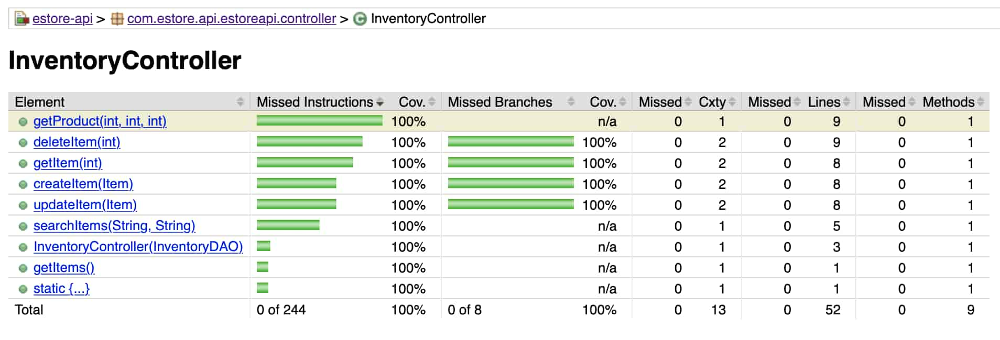


### Persistence


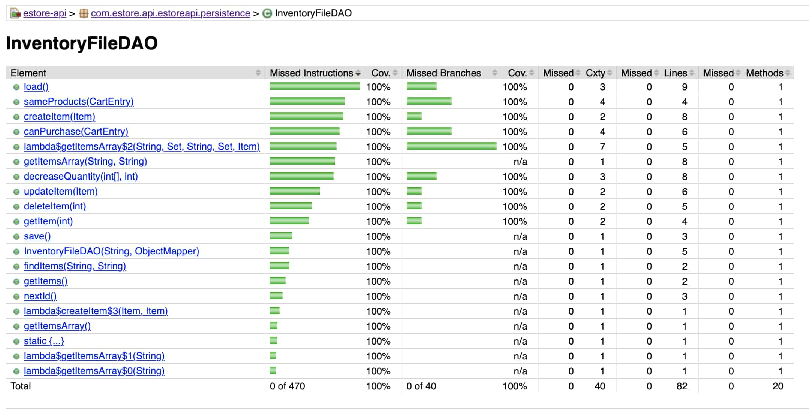

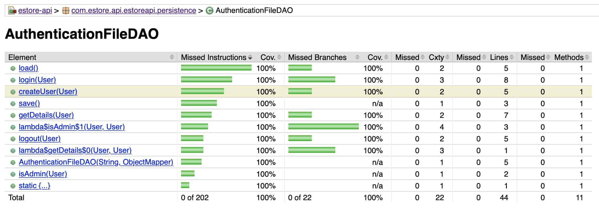


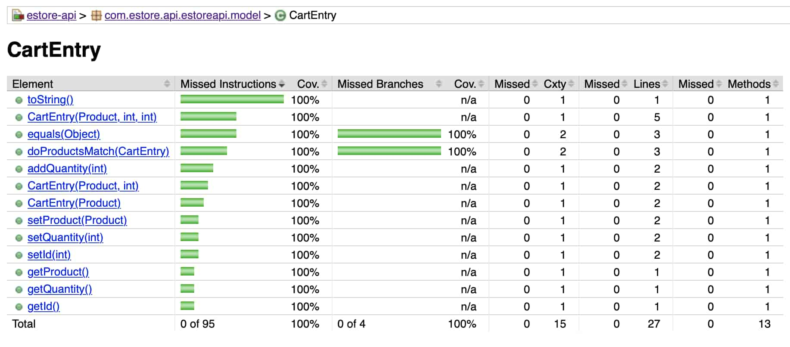

### Model


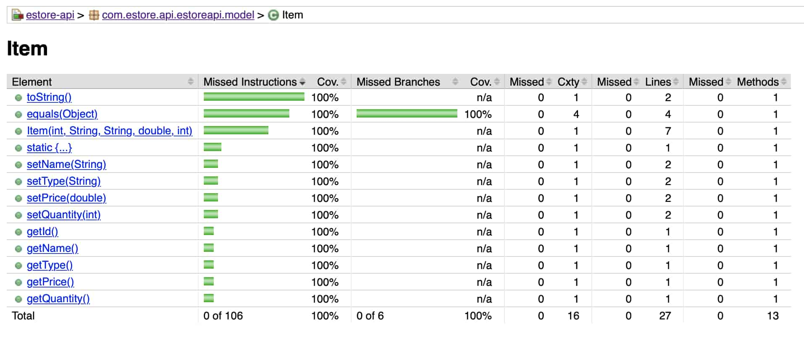


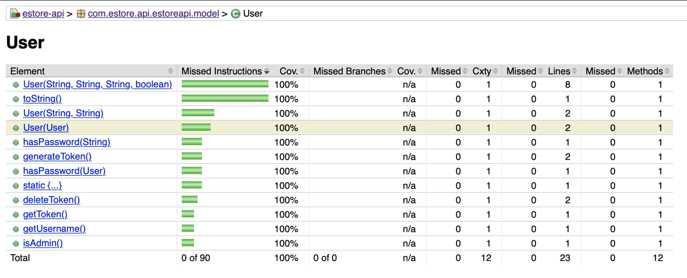


### Utilities


