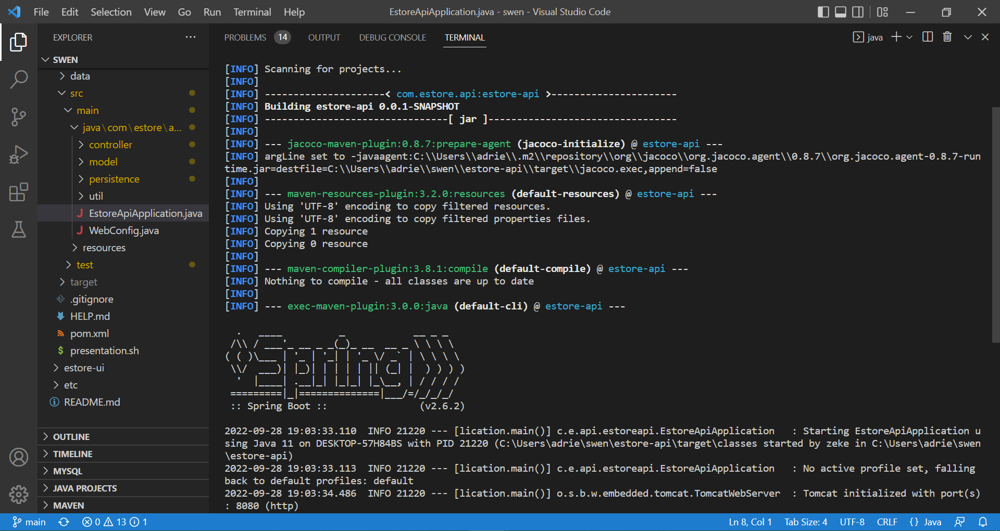
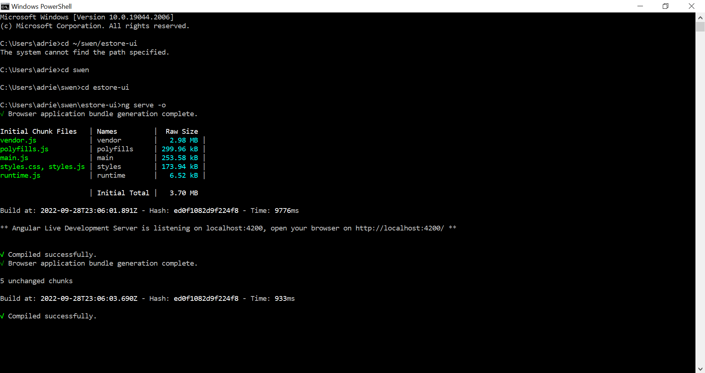

This document provides a comprehensive walkthrough of our website Aspen's Attic.

# Starting up the web application

To start up the web application, two steps must be taken:

# 1. Start up the Spring web server 

# 2. Start up Angular

The web application will then open up in a browser under localhost.

# Homepage
